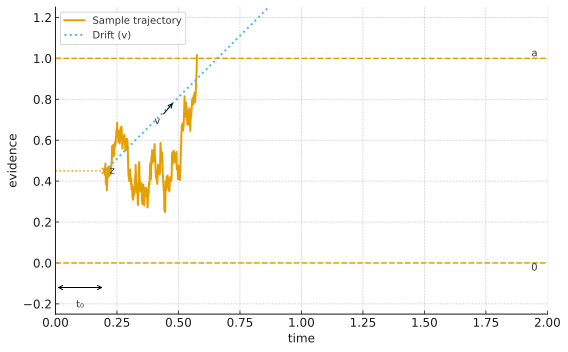

# 📦 ddModel: Core Functions for the Decision Diffusion Model

<!-- Badges -->
[](https://cran.r-project.org/package=ddModel)
[](https://cran.r-project.org/package=ddModel)
[](https://www.gnu.org/licenses/gpl-3.0)
[](https://github.com/yxlin/ddModel/actions/workflows/R-CMD-check.yaml)

`ddModel` provides fast and flexible computational tools for the **Decision Diffusion Model (DDM)** - a widely used cognitive model for analysing *choice* and *response time* (RT) in speeded decision-making tasks.

## 🔍 Overview
This package supports:
- **End-to-end DDM support**: density, distribution, and random sampling functions
- **Flexible parameterisation**:
  - Fix parameters globally
  - Constrain by experimental conditions
  - Vary subject-by-subject (hierarchical modelling ready)
- **Efficient likelihood evaluation**: fully vectorised for large-scale datasets
- **Seamless integration**: designed to work smoothly with the ggdmc


*Figure: Illustration of the DDM. Evidence accumulates over time with drift rate **v** until it reaches one of the decision boundaries (±**a**). The starting point **z** and non-decision time **t₀** are also shown; variability parameters (sv, sz, st₀) were set to 0.*


## 🧠 Key Features
- Implements canonical DDM components:
`a` (boundary separation), `v` (drift rate), `t₀` (non-decision time), `z` (starting point), plus optional variability parameters `sv`, `sz`, `st₀`
- Simulation tools for:
  - Subject-level and population-level datasets
  - Model recovery studies & power analysis
- Likelihood and density functions optimised for speed
- Ready for hierarchical modelling pipelines (ggdmcModel, ggdmcPrior, ggdmcHeaders)

## 📌 Who Is It For?
- **Experimental psychologists** modelling two-alternative forced-choice (2AFC) tasks
- **Cognitive scientists** running simulation-based model recovery or parameter estimation
- **Researchers and data scientists** needing synthetic data for benchmarking or educational demos

## 🚀 Quick Start
```r
# Install from CRAN
install.packages("ddModel")

# Or development version
# install.packages("devtools")
devtools::install_github("yxlin/ddModel")

library(ddModel)
library(ggdmcModel)
library(ggdmcPrior)
```

## ✅ Example Workflow

### 1. Build a DDM Specification

```r
# Load packages
library(ggdmcModel)
library(ggdmcPrior)
library(ddModel)

# Set up a stimulus drift rate model
model <- BuildModel(
  p_map = list(
    a = "1", v = "1", z = "1", d = "1", sz = "1", sv = "1",
    t0 = "1", st0 = "1", s = "1", precision = "1"
  ),
  match_map = list(M = list(s1 = "r1", s2 = "r2")),
  factors = list(S = c("s1", "s2")),
  constants = c(d = 0, s = 1, st0 = 0, precision = 3),
  accumulators = c("r1", "r2"),
  type = "fastdm"
)
```

### 2. Set up Hierarchical Priors

```r
# Set up a population-level prior distribution
pop_mean  <- c(a = 1, sv = 0.1, sz = 0.25, t0 = 0.15, v = 2.5, z = 0.38)
pop_scale <- c(a = 0.05, sv = 0.01, sz = 0.01, t0 = 0.02, v = 0.5, z = 0.01)
pop_dist  <- BuildPrior(
  p0    = pop_mean,
  p1    = pop_scale,
  lower = c(0, 0, 0, 0, -10, 0),
  upper = rep(NA, length(pop_mean)),
  dists = rep("tnorm", length(pop_mean)),
  log_p = rep(FALSE, length(pop_mean))
)

# Visualise the prior
plot_prior(pop_dist)
```

### 3. Simulate Data
```r
# Subject-level and population-level model setup
sub_model <- setDDM(model)
pop_model <- setDDM(model, population_distribution = pop_dist)

# Simulate subject-level data
p_vector <- c(a = 1, sv = 0.1, sz = 0.25, t0 = 0.15, v = 2.5, z = 0.38)
dat      <- simulate(sub_model, nsim = 256, parameter_vector = p_vector, n_subject = 1)

# Simulate hierarchical data (32 subjects)
hdat     <- simulate(pop_model, nsim = 128, n_subject = 32)
```

## ⚙️ Core Function Demo `pfastdm`

```r
RT <- seq(0.1, 1.2, 0.01)
params <- c(
  a = 1, v = 1.5, zr = 0.5, d = 0,
  sz = 0.05, sv = 0.01, t0 = 0.15, st0 = 0.001,
  s = 1, precision = 3
)
# Ensure parameter names are ordered
params <- params[sort(names(params))]

# Compute lower-bound response density
result <- pfastdm(RT, params, is_lower = TRUE, debug = TRUE)

```

## 🧩 Dependencies
- R (≥ 3.3.0)
- `Rcpp` (≥ 1.0.7)
- `RcppArmadillo` (≥ 0.10.7.5.0)
- `ggdmcModel`, `ggdmcPrior`, `ggdmcHeaders`


## 🔎 How Does `ddModel` Compare to `HDDM` and `fastdm`?
If you’ve worked with other diffusion model toolkits, you might wonder how ddModel fits in. Here’s a quick comparison:

- Language & Workflow Integration
  - HDDM: Python-based Bayesian modelling using PyMC; powerful but requires a Python workflow.
  - `fastdm`-dm: Stand-alone C++ executable; very fast, but limited R integration and less flexible parameter mapping.
  - `ddModel`: Native R + C++ (via RcppArmadillo), integrates seamlessly with R packages like ggdmc for hierarchical inference and DE-MCMC sampling.

- Flexibility
  - `ddModel` supports global, condition-wise, and subject-wise parameter specifications.
  - Exposes vectorised density and likelihood functions that can plug into any inference framework.
  - Easy simulation pipelines for subject-level or population-level data.

- Speed and Transparency
  - Written in modern Rcpp/C++; matches fastdm speed but remains fully open and modifiable within R.
  - Direct access to all functions; no need for command-line wrappers or external scripts.

- Educational and Research Use
  - Simple API for teaching and generating synthetic datasets.
  - Lightweight alternative if you don’t need HDDM’s full Bayesian machinery.

A comparison table at a glance:

| Tool        | Language   | Speed  | Bayesian Support      | Integration Style        |
| ----------- | ---------- | ------ | --------------------- | ------------------------ |
| `HDDM`      | Python     | Medium | Yes (PyMC3/PyMC)      | Python workflow only     |
| `fastdm`    | C++ binary | High   | No                    | CLI / external program   |
| **ddModel** | R + C++    | High   | Via `ggdmc` (DE-MCMC) | Native R, modular & open |

> Why choose ddModel?
>
> If you work primarily in R or use the `ggdmc` ecosystem, ddModel provides fast, flexible, and fully integrated DDM tools out of the box.

## 📚 Key References
- Voss, A., Rothermund, K., & Voss, J. (2004). Interpreting the parameters of the diffusion model: An empirical validation. *Behavior Research Methods, Instruments, & Computers*, 36(3), 347–360. [https://doi.org/10.3758/BF03196893](https://doi.org/10.3758/BF03196893)
- Voss, A., & Voss, J. (2007). Fast-dm: A free program for efficient diffusion model analysis. *Behavior Research Methods*, 39(4), 767–775. [https://doi.org/10.3758/BF03192967](https://doi.org/10.3758/BF03192967)
- Ratcliff, R., & McKoon, G. (2008). The diffusion decision model: Theory and data for two-choice decision tasks. *Neural Computation*, 20(4), 873–922. [https://doi.org/10.1162/neco.2008.12-06-420](https://doi.org/10.1162/neco.2008.12-06-420)


## 📬 Contact & Contributions

- **Yi-Shin Lin**
- Email: [yishinlin001@gmail.com](mailto:yishinlin001@gmail.com)
- GitHub: @yxlin

Contributions welcome! Please open an issue or pull request on GitHub.
